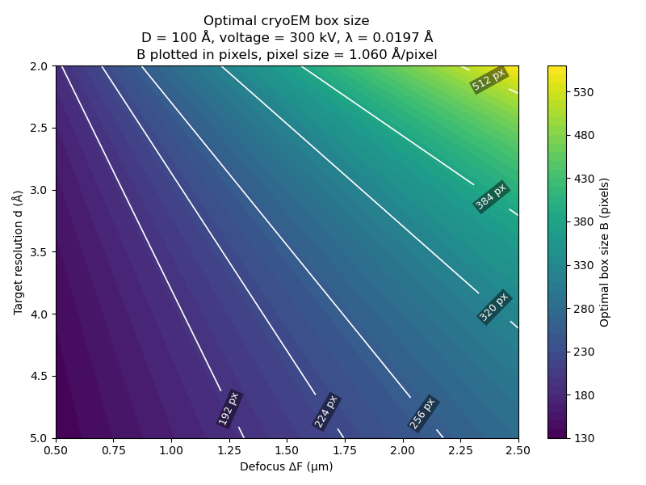
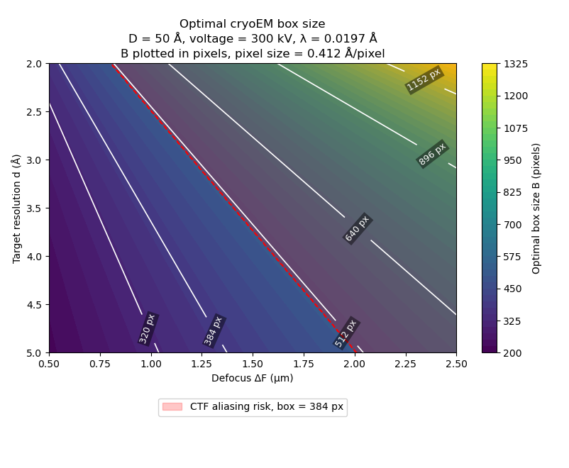

# cryoEM Optimal Box Size Plotter

Plots the [Rosenthal & Henderson](https://pubmed.ncbi.nlm.nih.gov/14568533/) estimate for optimal cryoEM particle box size as a function of defocus and target resolution.

The script uses:

```text
B = D + 2L(DeltaF / d)
```

where:

- `B` = optimal box size, Å
- `D` = particle diameter, Å
- `L` = electron wavelength, Å
- `DeltaF` = defocus, Å
- `d` = target resolution, Å

Defocus is entered in microns and converted internally to Angstroms.

Script was written with the assistance of ChatGPT; it is fairly simple and I have checked it, but please report errors/bugs if you encounter any.

## Requirements

```bash
pip install numpy matplotlib
```

## Basic usage

```bash
python3 optimal_box_size.py --diameter 250 --voltage 300
```

This plots optimal box size in Angstroms.

## Plot box size in pixels

Provide the calibrated pixel size in Angstroms/pixel:

```bash
python optimal_box_size.py --diameter 250 --voltage 300 --pixel-size 1.05
```

In pixel mode, contour lines are drawn at a selection of FFT-friendly good box sizes.

## Example:

```bash
python3 optimal_box_size.py  --diameter 50 --voltage 300 --pixel-size 0.412 --defocus-min 0.5 --defocus-max 2.5 --resolution-min 2 --resolution-max 5
```

## Useful options

```text
--diameter          Particle diameter in Angstroms. Required.
--voltage           Accelerating voltage in kV. Default: 300.
--pixel-size        Pixel size in Angstroms/pixel. Enables pixel-mode plotting of box size contours.
--defocus-min       Minimum defocus in microns. Default: 0.5.
--defocus-max       Maximum defocus in microns. Default: 3.0.
--resolution-min    Best target resolution in Angstroms. Default: 2.0.
--resolution-max    Worst target resolution in Angstroms. Default: 10.0.
--max-contours      Maximum number of box size contours. Default: 6.
--line-color        Contour line and label color. Default: white.
--output            Output image filename. Default: optimal_box_size_plot.png.
--dpi               Output image DPI. Default: 300.
--box-size          Shades the region (for a provided box size) that may be affected by CTF aliasing.
```

## Choosing a box size

Use the contour plot to estimate the required box size for your expected defocus and target resolution (and use when planning data collection to estimate a useful defocus range!):



Provide the `--box-size` argument to highlight the region that may be affected by [CTF aliasing](https://guide.cryosparc.com/cryo-em-foundations/image-formation/aliasing) at the selected box size:



So in this instance, for example, at a box size of 384 px (158 Å) & defocus of 2µm, aliasing is expected at resolutions better than 5Å; while at a defocus of 1µm, aliasing is not expected until 2.5Å at this box size.
